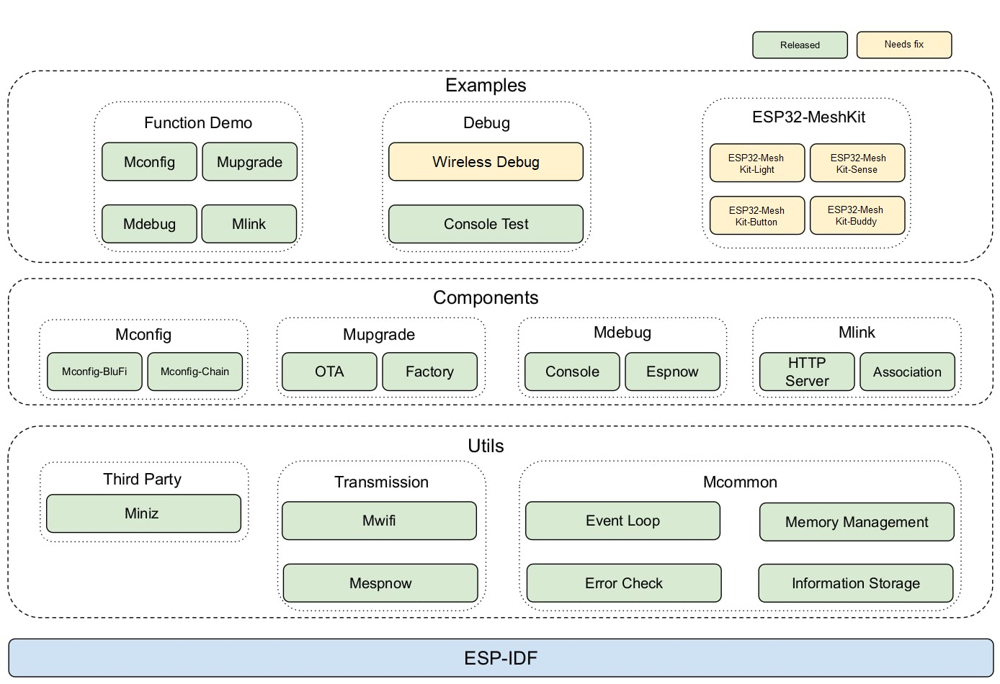

# ESP-WIFI-MESH Development Framework

### If you are looking for actively maintained repository for ESP-MDF, THIS IS NOT IT. There is none, unfortunatelly. 

This is just unofficial fork of ESP-MDF with some patches, ESP-IDF v5+ and WPA3 support. 

Key motivation was to have WPA3 support using actively maintained IDF version while also keeping IDF v4.4 compatibility for smoother transition of existing projects.

### Main improvements over [official ESP-MDF](https://github.com/espressif/esp-mdf/tree/master)

- **Supports IDF v4.4.x AND v5.x** (official MDF only supports now outdated [IDF v4.3.1](https://github.com/espressif/esp-mdf/tree/master?tab=readme-ov-file#quick-start) ).

- **Supports WPA3** [WiFi auth](https://github.com/mmrein/esp-mdf/blob/6e5399e60c5deeb4beaa77c8815c4dbb2426aab6/components/mwifi/mwifi.c#L532) if used with **IDF v5.4.1** or newer. You can also [select it in sdkconfig](https://github.com/mmrein/esp-mdf/blob/6e5399e60c5deeb4beaa77c8815c4dbb2426aab6/components/mwifi/Kconfig#L14) instead of digging in frameworks source files.

> ***Note:** Fix for WPA3 (see [IDF issue #14095](https://github.com/espressif/esp-idf/issues/14095)) has been added in following IDF releases: **v5.4.1, v5.3.?, v5.2.4, v5.1.6, v5.0.?** (v5.3 and v5.0 bugfixes not released yet at the time of writing).*

- Even with older IDF versions it defaults to [at least WPA2](https://github.com/mmrein/esp-mdf/blob/6e5399e60c5deeb4beaa77c8815c4dbb2426aab6/components/mwifi/mwifi.c#L535) (as opposed to official MDF with [plain old WPA](https://github.com/espressif/esp-mdf/blob/354d0bf687722570d2c22a71798a72ba17951030/components/mwifi/mwifi.c#L520)).

- Supported targets: `ESP32, ESP32-S2, ESP32-C3` and also `ESP32-S3`. With IDF v5+ it could support even more targets (currently not implemented).

- Various smaller bugfixes and improvements (including disabling mupgrade firmware checks that instead of preventing the CPU lockup does actually cause the CPU to stop running).

### Matters need attention

1. This version of MDF is **not recommended for product development**, just like the official one (which is now quite obsolete and still defaults to WPA1 btw). 
1. **Make sure you read release notes for v2.0.0** https://github.com/mmrein/esp-mdf/releases/tag/v2.0.0 if you are updating from original ESP-MDF. Especially the breaking changes, where minimum WPA2 auth mode will affect most users.
1. Care was taken to be somehow compatible with IDF v5+ while maintaining compatibility with latest IDF v4.4.x version. 
1. Testing is very limited and may only consist of building selected examples for some targets.
    - Test build was performed for `get-started, function_demo/*` examples and *esp32, esp32s2, esp32c3, esp32s3* targets.
    - Wireless-Debug and all Devkit examples were not tested and considered broken in its current state. 
    - Mileage of code running on actual hardware may vary.
1. Legacy make files are kept in original locations and state, not managed and not tested, not expected to work with IDF v5+.
1. Documentation may reflect original state rather than current state. Localized CN readme was removed to prevent more confusion as I am not able to maintain it.

----

## Overview

ESP-MDF, or Espressif Mesh Development Framework, is a development framework for [ESP-WIFI-MESH](https://docs.espressif.com/projects/esp-idf/en/v4.4.6/esp32/api-guides/esp-wifi-mesh.html), a networking protocol built on top of the Wi-Fi protocol. ESP-MDF is based on the [ESP32](https://www.espressif.com/en/products/hardware/esp32/overview) chip. ESP-MDF provides the following features:

- **Fast network configuration**: In addition to manual configuration with the network configuration apps, such as ESP-WIFI-MESH App or similar third-party apps, ESP-MDF offers a chained way of network configuration, during which devices autonomously and quickly establish a network, and form a greater coverage area.

- **Stable upgrade**: The upgrading process has become more efficient with such features as automatic retransmission of failed fragments, data compression,  etc.

- **Efficient debugging**: Various debugging approaches are supported, such as wireless transmission of logs and wireless debugging, debugging through a command terminal, etc.

- **LAN control**: Network can be controlled by an app, sensor, etc.

- **Various application demos**: It offers comprehensive solutions based on ESP-WIFI-MESH in the areas of lighting, etc.

## Framework

ESP-MDF consists of Utils, Components and Examples (see the below figure). Utils is the encapsulation and third-party library of ESP-IDF APIs. Components are the ESP-MDF functional modules that use Utils APIs. Examples are the ESP-WIFI-MESH solutions based on the Components.



- **Utils**：
  
    - Transmission: the way of data transmission between devices
        - [Mwifi](https://docs.espressif.com/projects/esp-mdf/en/latest/api-reference/mwifi/index.html): adds to ESP-WIFI-MESH the retransmission filter, data compression, fragmented transmission, and P2P multicast features
        - [Mespnow](https://docs.espressif.com/projects/esp-mdf/en/latest/api-reference/mespnow/index.html): adds to ESP-NOW the retransmission filter, Cyclic Redundancy Check (CRC), and data fragmentation features

    - Mcommon: modules shared by all ESP-MDF components
        - Event loop: deals with ESP-MDF events
        - Error Check: manages ESP-MDF's code errors
        - Memory Management: Memory Management for ESP-MDF
        - Information Storage: Store configuration information in flash
          
    - Third Party items
        - [Miniz](https://docs.espressif.com/projects/esp-mdf/en/latest/api-reference/third_party/index.html): lossless, high performance data compression library
     
- **Components**:
  
    - [Mconfig](https://docs.espressif.com/projects/esp-mdf/en/latest/api-guides/mconfig.html): network configuration module
    - [Mupgrade](https://docs.espressif.com/projects/esp-mdf/en/latest/api-guides/mupgrade.html): upgrade module
    - [Mdebug](https://docs.espressif.com/projects/esp-mdf/en/latest/api-guides/mupgrade.html): debugging module
    - [Mlink](https://docs.espressif.com/projects/esp-mdf/en/latest/api-guides/mlink.html): LAN control module

- **Examples**:
  
    - [Function demo](examples/function_demo/): Example of use of each function module
        - [Mwifi Example](examples/function_demo/mwifi): An example of common networking methods: router, no router, router on ethernet instead of wifi. This is recommended as good **starting point for most projects**.
        - [Mupgrade Example](examples/function_demo/mupgrade): Upgrade example of the device
        - [Mconfig Example](examples/function_demo/mconfig): Example of network configuration of the device
        - [Mcommon Examples](examples/function_demo/mcommon): Common Module Example, Event Processing Memory Management Example of Using Information Store

    - Debug: Performance Testing and Debugging Tools
        - [Console Test](examples/function_demo/mwifi/console_test): Test the ESP-WIFI-MESH throughput, network configuration, and packet delay by entering commands through the serial port.
        - [Wireless Debug](examples/wireless_debug/): ESP-MDF debugging via wireless
     
     - [Development Kit](examples/development_kit/): ESP32-MeshKit usage example for research and understanding of ESP-WIFI-MESH *(Note: possibly broken, not tested)*
        - [ESP32-MeshKit-Light](examples/development_kit/light/): Smart lighting solution with ESP-WIFI-MESH functioning as the master network. The kit consists of light bulbs with integrated ESP32 chips. Support BLE + ESP-MDF for BLE gateway, ibeacon and BLE scanning
        - [ESP32-MeshKit-Sense](examples/development_kit/sense/): Development board, specifically designed for applications where ESP-WIFI-MESH is in Light-sleep or Deep-sleep mode. The board provides solutions for:
           - Monitoring the power consumption of MeshKit peripherals
           - Controlling MeshKit peripherals based on the data from multiple onboard sensors. 
        - [ESP32-MeshKit-Button](examples/development_kit/button/): Smart button solution, tailored for ESP-WIFI-MESH applications with ultra-low power consumption. The device wakes up only for a short time when the buttons are pressed and transmits packets to ESP-WIFI-MESH devices via [ESP-NOW](https://docs.espressif.com/projects/esp-idf/en/stable/api-reference/network/esp_now.html).
          
## Develop with ESP-MDF

1. First, you should get familiar with concepts of [ESP-WIFI-MESH Communication Protocol](https://docs.espressif.com/projects/esp-idf/en/stable/esp32/api-guides/esp-wifi-mesh.html) and [ESP-MDF Programming Guide](https://docs.espressif.com/projects/esp-mdf/en/latest/?badge=latest) (currently not 100% updated)
1. Try some examples on real hardware. Any ESP32 devkit should work for basic networking.
1. Use [Function demo](examples/function_demo/) for your project development
1. When you encounter problems in development - lets be real here - you are probably on your own.
    - There is [forum](https://esp32.com/viewforum.php?f=21&sid=27bd50a0e45d47b228726ee55437f57e) and [official issues](https://github.com/espressif/esp-mdf/issues) where you can search for existing problems.
    - If there is no such problem, you could post an issue in official MDF, but you will most likely only get tony's *message delivered* confirmation.
    - You may try asking here too, but it will likely get even less traction here and my support will be very limited.

## Quick Start

This section provides the steps for quick start with your development of ESP-MDF applications. But first of all, please refer to [ESP-IDF Get Started](https://docs.espressif.com/projects/esp-idf/en/stable/esp32/get-started/index.html).

The directory ``~/esp`` will be used further to install the compiling toolchain, ESP-MDF and demo programs. You can use another directory, but make sure to modify the commands accordingly.

### 1. Setup Prerequisites

#### 1.A Toolchain setup

Use [ESP-IDF Guide](https://docs.espressif.com/projects/esp-idf/en/stable/esp32/get-started/index.html#installation), set up according to your PC's operating system. 

If you use linux, you can use following commands (example).

```shell
git clone -b v4.4.6 --recursive https://github.com/espressif/esp-idf.git
cd ~/esp/esp-idf
./install.sh
. ./export.sh
```

#### 1.B Get ESP-MDF

Clone this repo:

```shell
git clone --recursive https://github.com/mmrein/esp-mdf.git
```

> If you clone without the `--recursive` option, please navigate to the esp-mdf directory and run the command `git submodule update --init`

#### 1.C Update ESP-MDF

In case you wish to update the the ESP-MDF to newest version

```shell
cd ~/esp/esp-mdf
git pull
git submodule update --init --recursive
```

### 2. Actual setup

#### 2. Option A: Using ESP_MDF environment variable (default option)

1. Set up ESP-MDF Path:

Toolchain uses the environment variable `MDF_PATH` to access ESP-MDF. The setup of this variable is similar to that of the variable `IDF_PATH`. Please refer to [Set up the Environment Variables](https://docs.espressif.com/projects/esp-idf/en/stable/esp32/get-started/linux-macos-setup.html#step-4-set-up-the-environment-variables) guide. If you use linux, you can use this commands.

```shell
cd ~/esp/esp-mdf
export MDF_PATH=~/esp/esp-mdf
```

2. Start a Project:

```shell
cp -r $MDF_PATH/examples/get-started/ .
cd  get-started/
```

3. Build and Flash:

For the rest, just keep the default configuration untouched.

```shell
idf.py menuconfig
idf.py -p [port] -b [baudrate] erase_flash flash
```
    
#### 2. Option B: Don't use MDF build system at all (and play it safe in long run)

MDF build system is working quite well from terminal, but using Espressif's IDE's may be tricky as MDF is not really supported anymore.
Therefore the safer option is to use the project **as any other regular ESP-IDF project**, without ESP-MDF build system. 

0. (Optional) Set-up MDF_PATH temporarily just to follow this example 1:1

```shell
export MDF_PATH=~/esp/esp-mdf
```

1. Copy [get-started](examples/get-started/) (or other project you like) from MDF directory to your working location

```shell
cp -r $MDF_PATH/examples/get-started/ .
cd  get-started/
```

2. Copy contents of `$MDF_PATH/components` directory to your project's `componnets` directory

```shell
cp -r $MDF_PATH/components .
```

3. Uncomment `#define MDF_VER` macro in `mcommon/include/mdf_common.h`. It should have correct version prefilled.
  
```shell
nano mcommon/include/mdf_common.h
```

4. Edit project's CMakeLists.txt by removing `MDF_PATH` references and using standard IDF path instead

Replace:

```
if(NOT DEFINED ENV{MDF_PATH})
    set(ENV{MDF_PATH} ${CMAKE_CURRENT_LIST_DIR}/../..)
endif()
include($ENV{MDF_PATH}/project.cmake)
```

With:

```
include($ENV{IDF_PATH}/tools/cmake/project.cmake)
```

5. Voila, you can now build the MDF-based project using standard ESP-IDF build setup.

> These steps may seem more complicated, but you will likely see that it is overall more reliable and versatile approach to building your project based on ESP-MDF.


## ESP-WIFI-MESH Highlights

* **Easy setup**: ESP-WIFI-MESH expands the original Wi-Fi hotspot range to the reach of the most distant node in the mesh cloud. Such a network is automatically formed, self-healing and self-organizing. It saves the efforts of laying cables. All you need to do is configure the router password.

* **Gateway free**: The decentralized structure of ESP-WIFI-MESH with the absence of a gateway precludes the overall network breakdown if one single node fails. Even if there is a single ESP-WIFI-MESH device, the network still works as usual.

* **Safer transmission**: Both the data link layer and the application layer can be encrypted.

* **More reliable transmission**: The transmission and data flow control between two devices are more reliable. Also, unicast, multicast and broadcast transmissions are supported.

* **Large network capacity**: ESP-WIFI-MESH takes the form of a tree topology, so one single device can connect to 10 devices at maximum, and an entire network can have over 1,000 nodes (theoretically, your mileage may vary).

* **Wider transmission coverage**: The transmission distance between two devices is 30 m through walls, and 200 m without any obstacles in between (relevant to ESP32-DevKitC).
    * **Smart Home**: Even if there are only three to five devices in your home, they can form a network and communicate with one another through walls.
    * **Street light**: If ESP-WIFI-MESH is used for the street lighting scenario, two long-distance devices can communicate with each other.

* **High transmission speed**: For Wi-Fi transmission, the speed can reach up to **10 Mbps**.
    * **Environment Control System**: Directly transfers the raw data collected by sensors and analyzes mass data for calibration of algorithms, thereby improving sensors' accuracy.
    * **Background Music System**: Both audio and video transmissions are supported.
    
* **Simultaneously run Wi-Fi and BLE protocol stacks**: ESP32 chips can run both Wi-Fi and BLE protocol stacks side by side and use ESP-WIFI-MESH as the main network to transmit data, receive BLE probe beacon, send BLE broadcasts and connect BLE devices.
    * **Items tracing**: Monitors the BLE or Wi-Fi data packets from a device at multiple selected spots.
    * **Pedestrian counting**: Through monitoring Wi-Fi probe request frames.
    * **Indoor positioning**: Each device functions as a Beacon AP, continuously sending Bluetooth signal to the surroundings. The network can analyze a device's signal intensity and calculate its current position.
    * **Product promotion**: Sends real-time product information and promotions through iBeacon.
    * **Bluetooth gateway**: With each device serving as a Bluetooth gateway, traditional Bluetooth devices can also be connected to an ESP-WIFI-MESH network.

## Related Documentation

* For ESP-MDF related documents, please go to [ESP-MDF Programming Guide](https://docs.espressif.com/projects/esp-mdf/en/latest/?badge=latest).
* [ESP-WIFI-MESH](https://docs.espressif.com/projects/esp-idf/en/v4.4.6/esp32/api-guides/esp-wifi-mesh.html) is the basic wireless communication protocol for ESP-MDF.
* [ESP-IDF Programming Guide](https://docs.espressif.com/projects/esp-idf/en/v4.4.6/esp32/api-guides/esp-wifi-mesh.html) describes Espressif's IoT development framework.
* To visit ESP32 official forum, please go to [ESP32 BBS](https://esp32.com/).
* For the hardware documents related to ESP32-MeshKit, please visit [Espressif Website](https://www.espressif.com/en/support/documents/technical-documents).


